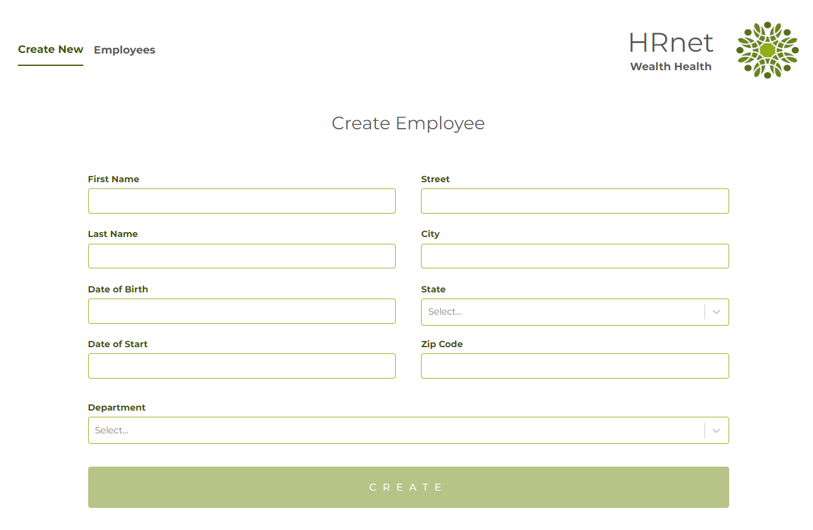
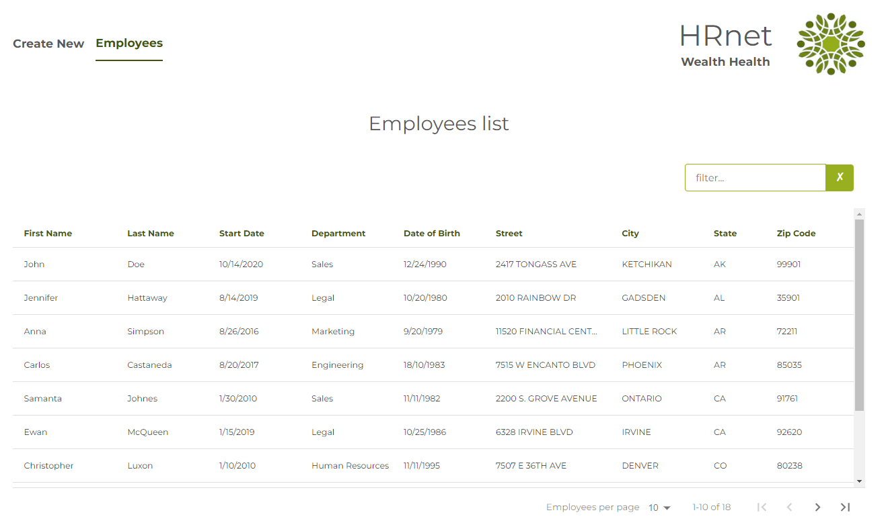

# HRnet


## Presentation

HRnet is a redesign with React of the internal jQuery [`HR app`](https://github.com/OpenClassrooms-Student-Center/P12_Front-end) managing employee records in order to increase performance and fix bugs in jQuery plugins.

Instead of the 4 jQuery plugins, this HRnet application uses React components imported from existing libraries, except for the Modal package created for this occasion.




## Live demo of HRnet app is available on Github Pages [here](https://hrnet-react-tau.vercel.app/)

## Local setup

1. Clone and/or fork this repository.
2. Then, run the development server:

```bash
npm run dev
# or
yarn dev
# or
pnpm dev
```

3. Open [http://localhost:3000](http://localhost:3000) with your browser to see the result.

## Modal component

Available on NPM: [Modal NPM](https://www.npmjs.com/package/zz-modal)
or [`GitHub repo`](https://github.com/ZhannaZucher/zz-modal-library.git).

### Prerequisites


### Dependencies


### DevDependencies


